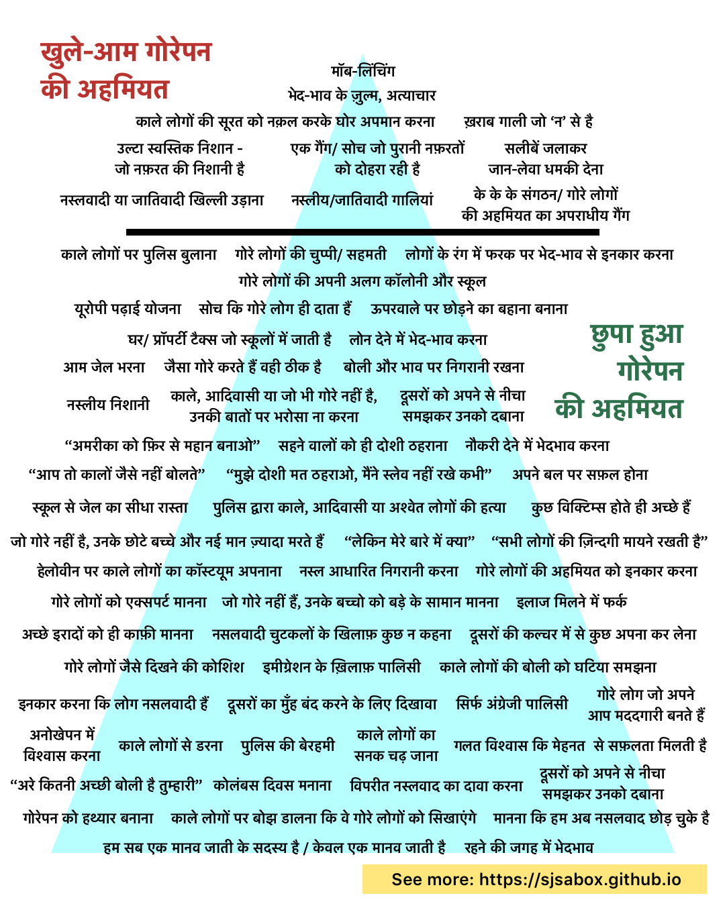
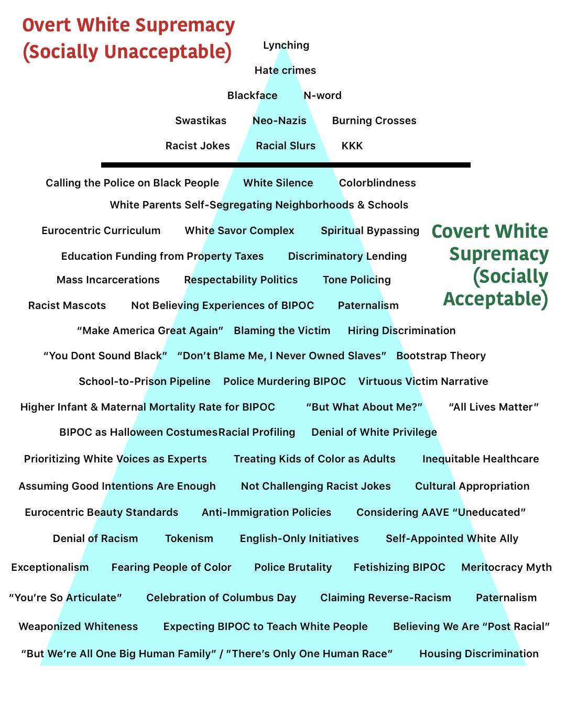

# Anti-Blackness & White Supremacy Terms - Hindi Translations
These are the Hindi translations for the popular White Supremacy 🔺 graphic featuring a set of 67 terms that describe overt &amp; covert forms of racism. The Hindi translations are accompanied with their English transliterations, and some handy links to 📰 articles and other 🎥 🎤 🎧 🎨 media that explain or are references for each concept. (For other languages, please visit our [homepage](https://sjsabox.github.io).)

### [Hindi Graphic](img/Hindi.png) | [Hindi Transliterated Graphic](img/Hindi%20Transliteration.png) | [Original Graphic](img/Original.png)

      

## Who is this for?

Many of us may simply understand racism as singular acts of hate or unkindness between ethnic groups when in reality, racism is a social construct that powers white supremacy via hidden systems of dominance. As we, South Asian Americans, mobilize as active citizens alongside Black Americans against racial injustices, it is important that we arm ourselves, our families, friends, coworkers, and social circles by investigating how white privilege is a legislative, economic, and cultural norm in America. 

We made this effort to translate forms of white supremacy into Hindi to create some language that can help you reach across language and generation gaps and start conversations with people you know who may not have done this work yet. Additionally, we have added article & media links to further contextualize these concepts in the North American setting. Use this resource to educate yourself so that you may educate others.  

## Terms, Translations, Transliterations, Expanded Explanations, Reference Links

Below, each term is translated individually in the Devanagari script for Hindi, then transliterated into English for easier reading. Some terms also have an 📌 expanded definition for contextualization or clarifications of the shorter translation. Where appropriate, links 🔗 have been added that offer general explanations or examples where these issues directly effect BIPOC, or specifically South Asians in North America 🌎. 

## Overt White Supremacy  - खुले-आम गोरेपन की अहमियत  - Khule-aam gorepan kii ahmiyat

### 1. Lynching
	मॉब-लिंचिंग
	Mob lynching 
	
🔗 References: 

[“The oppression doesn’t end, it adapts”](https://www.vox.com/21295670/robert-fuller-malcolm-harsch-hanging-history-lynching) 

[Terror Lynching in America](https://www.youtube.com/watch?v=aS61QFzk2tI) 

### 2. Hate crimes
	भेद-भाव के ज़ुल्म, अत्याचार
	Bhed-bhaav ke zulm, atyaachaar 
	
🔗 References: 

[Hate Crimes Explained](https://www.splcenter.org/20180415/hate-crimes-explained)

[Black Americans still are victims of hate crimes more than any other group](https://publicintegrity.org/politics/black-americans-still-are-victims-of-hate-crimes-more-than-any-other-group/)

[Kansas man sentenced to life for killing Indian engineer in a bar](https://www.nbcnews.com/news/asian-america/kansas-man-sentenced-life-prison-hate-crime-shooting-n898361)

### 3. Blackface
	काले लोगों की सूरत को नक़ल करके घोर अपमान करना
	Kaale logon ki surat ko nakal karke ghor apmaan karnaa
	
🔗 References:

[Why is Blackface Offensive](https://www.vox.com/2014/10/29/7089591/why-is-blackface-offensive-halloween-costume)

[Blackface, Staple of Arab Comedy](https://www.nytimes.com/2019/08/18/world/middleeast/blackface-arab-tv-racist.html)

[Brownface at Bon Appetit](https://www.insider.com/bon-appetit-editor-adam-rapoport-resigned-dressed-puerto-rican-photo-2020-6)

### 4. The N-word
	ख़राब गाली जो ‘न’ से है
	Xaraab gaalii jo N se hai

🔗 References:

[When Latinx People Use the N-Word](https://www.nytimes.com/2019/10/17/opinion/gina-rodriguez-n-word-latinx.html)

[BBC apologizes for use of N-word in news report](https://www.cnn.com/2020/08/10/media/bbc-apology-offensive-language-scli-intl-gbr/index.html)

### 5. Swastikas
	उल्टा स्वस्तिक निशान - जो नफ़रत की निशानी है
	Ulta Swastik Nishaan - jo nafrat ki nishaani hai

🔗 References:

### 6. Neo-Nazis
	एक गैंग/ सोच जो पुरानी नफ़रतों को दोहरा रही है
	Ek gang/soch jo purani nafratoN ko dohraa rahii hai

🔗 References:

[Self-described Nazis and white supremacists are running as Republicans across the country](https://www.vox.com/2018/7/9/17525860/nazis-russell-walker-arthur-jones-republicans-illinois-north-carolina-virginia)

### 7. Burning Crosses
	सलीबें जलाकर जान-लेवा धमकी देना
	Saleeben jalaakar jaan leva dhamkii dena (jaativaad apraadh/ KKK)

🔗 References:

[A Decision on Cross Burning](https://www.nytimes.com/2003/04/08/opinion/a-decision-on-cross-burning.html)

[Virginia Man Accused of Burning Cross on Lawn of Black Teen Protest Organizer](https://www.nbcwashington.com/news/local/virginia-man-charged-in-connection-with-cross-burning/2345942/)

[Authorities investigate cross burning in Alabama](https://thehill.com/homenews/state-watch/501477-authorities-investigate-cross-burning-in-alabama)

### 8. Racist Jokes
	नस्लवादी या जातिवादी खिल्ली उड़ाना
	Nasalvadi yaa jaativaadii khilli uRaana)

🔗 References:

[She didn’t laugh at racist jokes. Her coach said she didn’t have the right ‘chemistry’ for the team.](https://www.washingtonpost.com/local/public-safety/student-refuses-to-let-the-bullies-win/2017/04/24/623187e4-1ba1-11e7-bcc2-7d1a0973e7b2_story.html)

[Asian American racism is the unfunny joke the comedy world needs to reckon with](https://www.vox.com/the-highlight/2020/1/15/21065939/comedy-racism-asian-american-rosie-odonnell-shane-gillis-awkwafina-ali-wong)

[The controversy over YouTube star PewDiePie and his anti-Semitic “jokes,” explained](https://www.vox.com/culture/2017/2/17/14613234/pewdiepie-nazi-satire-alt-right)

### 9. Racial Slurs
	नस्लीय/जातिवादी गालियां
	Nasliiy/Jaativaadi Gaaliyaan

🔗 References:

[When Slang Becomes a Slur](https://www.theatlantic.com/entertainment/archive/2014/06/a-linguist-on-why-redskin-is-racist-patent-overturned/373198/)

### 10. KKK
	के के के संगठन/ गोरे लोगों की अहमियत का अपराधीय गैंग
	KKK Sangathan/ Gore logon kii ahmiyat ka apradhiiy gang

🔗 References:

[Ku Klux Klan](https://www.splcenter.org/fighting-hate/extremist-files/ideology/ku-klux-klan)

["Why we voted for Donald Trump": David Duke explains the white supremacist Charlottesville protests](https://www.vox.com/2017/8/12/16138358/charlottesville-protests-david-duke-kkk)

## Covert White Supremacy 
छुपा हुआ गोरेपन की अहमियत 
Chhupaa hua gorepan kii ahmiyat

### 11. Calling the Police on Black People	
	काले लोगों पर पुलिस बुलाना 
	Kaale logon par police bulaana
	
🔗 References:

[Why Did Cup Foods Call the Cops on George Floyd?](https://www.nytimes.com/2020/06/17/opinion/george-floyd-arab-muslims-racism.html)

[White woman who called police on a black man bird-watching in Central Park has been fired](https://www.cnn.com/2020/05/26/us/central-park-video-dog-video-african-american-trnd/index.html)	

### 12. White Silence	
	गोरे लोगों की चुप्पी/ सहमती	
	Gore logon kii chuppii/ sahmatii 

🔗 References:

[Why white silence is deafening — and deadly](https://www.salon.com/2020/05/31/why-white-silence-is-deafening-and-deadly/)

[Black mother explains why white silence is so painful](https://www.youtube.com/watch?v=RwZKU4wUeKs)

### 13. Colorblindness	
	लोगों के रंग में फरक पर भेद-भाव से इनकार करना	
	Logon ke rang me farak par bhed-bhaav se inkaar karnaa

🔗 References:

[White parents teach their children to be colorblind. Here’s why that’s bad for everyone](https://www.washingtonpost.com/nation/2018/10/05/white-parents-teach-their-children-be-colorblind-heres-why-thats-bad-everyone/)

### 14. White Parents Self-Segregating Neighborhoods & Schools	
	गोरे लोगों की अपनी अलग कॉलोनी और स्कूल	
	Gore logon kii apnii alag colony aur school

🔗 References:

[New York Times - Nice White Parents](https://www.nytimes.com/2020/07/30/podcasts/nice-white-parents-serial.html) 🎧

[White America is quietly self-segregating](https://www.vox.com/2017/1/18/14296126/white-segregated-suburb-neighborhood-cartoon)

[
Despite the Best Intentions: How Racial Inequality Thrives in Good Schools](https://bookshop.org/books/despite-the-best-intentions-how-racial-inequality-thrives-in-good-schools/9780190669829)

### 15. Eurocentric Curriculum	
	यूरोपी पढ़ाई योजना	
	Europii paRhaaii yojnaa

🔗 References:

[How US history is whitewashed in high school exams](https://www.aljazeera.com/indepth/opinion/history-whitewashed-high-school-exams-190701132525633.html)

[New York Times - 1619 Project](https://www.nytimes.com/2019/08/23/podcasts/1619-slavery-anniversary.html) 🎧

[History Class & Fictions About Race](https://www.theatlantic.com/education/archive/2015/10/the-history-class-dilemma/411601/)

### 16. White Savior Complex	
	सोच कि गोरे लोग ही दाता हैं	
	Soch ki gore log hii daataa haiN

🔗 References:

[The White Savior Industrial Complex](https://www.theatlantic.com/international/archive/2012/03/the-white-savior-industrial-complex/254843/)

[Can Outsiders Make Films About India in an Honest Way?](https://www.kqed.org/arts/11483013/can-outsiders-make-films-about-india-in-an-honest-way)

### 17. Spiritual Bypassing	
	ऊपरवाले पर छोड़ने का बहाना बनाना	
	Uupar vaale par chhoRne kaa bahaanaa banaanaa

🔗 References:

[A Message From Your Pastor For Such A Time As This](https://www.youtube.com/watch?v=AJJHgkPH9tU&feature=youtu.be) 📺

[Evangelical Christians Grapple With Racism As Sin](https://www.npr.org/2020/06/06/871014393/evangelical-christians-grapple-with-racism-as-sin)

### 18. Education Funding from Property Taxes	
	घर/ प्रॉपर्टी टैक्स जो स्कूलों में जाती है	
	Ghar/property kii tax jo schooloN meN jaatii hai

🔗 References:

[Report finds $23 billion racial funding gap for schools](https://www.washingtonpost.com/local/education/report-finds-23-billion-racial-funding-gap-for-schools/2019/02/25/d562b704-3915-11e9-a06c-3ec8ed509d15_story.html)

[EdBuild - Clean Slate](https://edbuild.org/content/clean-slate)

[Code Switch - A Tale Of Two School Districts](https://www.npr.org/2019/09/11/731867149/a-tale-of-two-school-districts) 🎧

[NPR Live Updates - Why U.S. Schools Are Still Segregated And One Idea To Help Change That](https://www.npr.org/sections/live-updates-protests-for-racial-justice/2020/07/07/888469809/how-funding-model-preserves-racial-segregation-in-public-schools) 🎧

### 19. Discriminatory Lending	
	लोन देने में भेद-भाव करना	
	Loan dene meN bhed bhaav karnaa

🔗 References:

[Wells Fargo accused of preying on black and Latino homebuyers in California](https://money.cnn.com/2018/02/27/investing/wells-fargo-sacramento-lawsuit-discriminatory-lending/index.html)

[How Some Algorithm Lending Programs Discriminate Against Minorities](https://www.npr.org/2018/11/24/670513608/how-some-algorithm-lending-programs-discriminate-against-minorities)

### 20. Mass Incarceration	
	आम जेल भरना	
	Aam jail bharnaa
	
🔗 References:

[ACLU - Mass Incarceration](https://www.aclu.org/issues/smart-justice/mass-incarceration)

[How We Misunderstand Mass Incarceration](https://www.newyorker.com/magazine/2017/04/10/how-we-misunderstand-mass-incarceration)

	
### 21. Respectability Politics	
	जैसा गोरे करते हैं वही ठीक है	
	Jaisaa gore karte haiN vohii Thiik hai
	
🔗 References:

[Systemic Racism Couldn’t Care Less About Your Respectability Politics](https://www.thenation.com/article/archive/systemic-racism-could-care-less-about-your-respectability-politics/)

['Respectability Politics' Won't Protect Black Americans From Racism | NowThis](https://www.youtube.com/watch?v=mfIlqoNcpDs) 📺

[Code Switch - Respect Yourself](https://www.npr.org/2019/03/13/692206390/respect-yourself) 🎧
	
### 22. Tone Policing	
	बोली और भाव पर निगरानी रखना	
	Boli aur bhaav par nigraanii rakhnaa
	
🔗 References:

[Tone policing is a little-known microaggression that's common in the workplace — here's how to identify it](https://www.businessinsider.com/how-to-identify-and-help-stop-tone-policing-in-workplace-2020-8) 
	
### 23. Racist Mascots	
	नस्लीय निशानी	
	Nasliiy nishaanii
	
🔗 References:

[Washington’s NFL team is finally rid of its racist name — 50 years late](https://www.washingtonpost.com/opinions/washingtons-nfl-team-is-finally-rid-of-its-racist-name--50-years-late/2020/07/13/aca3e2ce-c538-11ea-b037-f9711f89ee46_story.html)

[Still Processing - Reparations for Aunt Jemima](
https://www.nytimes.com/2020/07/16/podcasts/reparations-for-aunt-jemima.html) 🎧

[Food Brands Are Finally Changing Their Racist Mascots—But Is It Enough?](https://www.delish.com/food/a33313212/food-brands-racist-mascots-logos/)

[15 racist brands, mascots, and logos that were considered just another part of American life](https://www.businessinsider.com/15-racist-brand-mascots-and-logos-2014-6)
	
### 24. Not Believing Experieces of BIPOC	
	काले, आदिवासी या जो भी गोरे नहीं है, उनकी बातों पर भरोसा ना करना	
	Kaale, aadivaasii yaa jo bhii gore nahiin haiN, unkii baatoN par bharosaa naa karnaa
	
🔗 References:

[Sorry To Bother You](https://www.hulu.com/movie/sorry-to-bother-you-c66b772e-75e9-43b1-bcb7-e09ce9e8582d)

[When They See Us](https://www.netflix.com/title/80200549) 📺

[Dear White People](https://www.netflix.com/title/80095698) 📺

### 25. "Make America Great Again"	
	"अमरीका को फ़िर से महान बनाओ"
	"Amriikaa ko phir se mahaan banaao"
	
🔗 References:

[Make America White Again](https://www.theatlantic.com/politics/archive/2016/03/donald-trump-kkk/473190/)

### 26. Blaming the Victim	
	सहने वालों को ही दोशी ठहराना	
	Sahne vaale ko hii doshii thahraanaa
	
🔗 References:

[Black doesn’t mean criminal. Conservatives should know that by now.](https://www.washingtonpost.com/outlook/2020/05/18/ahmaud-arbery-conservatives-reaction/)

[Stop Blaming Black People For Dying of Coronavirus](https://www.theatlantic.com/ideas/archive/2020/04/race-and-blame/609946/)

### 27. Hiring Discrimination	
	नौकरी देने में भेदभाव करना	
	Naukrii dene meN bhedbhaav karnaa
	
🔗 References:

[Workplace discrimination is illegal. But our data shows it’s still a huge problem.](https://www.vox.com/policy-and-politics/2019/2/28/18241973/workplace-discrimination-cpi-investigation-eeoc)

['We Have A Black People Problem': Facebook Worker Claims Racial Discrimination](https://www.npr.org/2020/07/02/886544638/we-have-a-black-people-problem-facebook-worker-claims-racial-discrimination)

[Dear White Boss](https://hbr.org/2002/11/dear-white-boss)

### 28. "You don't sound Black"	
	आप तो कालों जैसे नहीं बोलते	
	"Aap to kaaloN jaise nahiiN bolte!"
	
🔗 References:

['You're So Articulate': Why Microaggressions Wear People Down](https://www.kuow.org/stories/youre-so-articulate-why-microaggressions-wear-people-down)

### 29. "Don't BLame Me, I Never Owned Slaves"	
	मुझे दोशी मत ठहराओ, मैंने स्लेव नहीं रखे कभी	
	"Mujhe doshii mat thahraao, maine slave nahiiN rakkhe kabhii"
	
🔗 References:

### 30. Bootstrap Theory	
	अपने बल पर सफ़ल होना	
	Apne bal par saphal honaa
	
🔗 References:

[Kimberly Latrice Jones](https://www.youtube.com/watch?v=llci8MVh8J4) 📺

[Pull Yourself Up by Bootstraps? Go Ahead, Try It](https://www.nytimes.com/2020/02/19/opinion/economic-mobility.html)

### 31. School-to-Prison Pipeline	
	स्कूल से जेल का सीधा रास्ता	
	Skuul se jail kaa siidhaa raastaa
	
🔗 References:

[Notes From The Field](https://www.hulu.com/movie/notes-from-the-field-dfb792f7-37f2-4b8e-8bc7-51576f0ad71d) 📺

### 32. Police Murdering BIPOC	
	पुलिस द्वारा काले, आदिवासी या अश्वेत लोगों की हत्या	
	Pulis dwaaraa kaale, aadivaasii ya ashwet logoN kii hatyaa
	
🔗 References:

[Mapping Police Violence](https://mappingpoliceviolence.org/)

[An Abbreviated History of Police Officers Killing Black People](https://www.latimes.com/opinion/story/2020-06-04/police-killings-black-victims)

[Police Kill A Latino Man In California, Admit He Didn't Have Gun](https://www.npr.org/2020/06/05/871083536/police-kill-a-latino-man-in-california-admit-he-didnt-have-gun)

[How the death of Mississauga man Ejaz Choudry helped spark a provincewide conversation about police reform](https://www.thestar.com/news/gta/2020/07/14/how-the-death-of-mississauga-man-ejaz-choudry-helped-spark-a-provincewide-conversation-about-police-reform.html)

### 33. Virtuous Victim Narrative	
	कुछ विक्टिम्स होते ही अच्छे हैं	
	Kuchh victims hote hii achche haiN 
	
🔗 References:

[How the 'Karen Meme' Confronts the Violent History of White Womanhood](https://time.com/5857023/karen-meme-history-meaning/)

### 34 Higher Infant & Maternal Mortality Rate for BIPOC	
	जो गोरे नहीं है, उनके छोटे बच्चे और नई मान ज़्यादा मरते हैं	
	Jo gore nahiiN haiN un ke chhote bachche aur naii maaN zyaadaa marte haiN
	
🔗 References:

[Huge Racial Disparities Found in Deaths Linked to Pregnancy](https://www.nytimes.com/2019/05/07/health/pregnancy-deaths-.html)

### 35. "But What About Me?"	
	लेकिन मेरे बारे में क्या	
	"Lekin mere baare meN kyaa?"
	
🔗 References:

[]

### 36. "All Lives Matter"	
	सभी लोगों की ज़िन्दगी मायने रखती है	
	"Sabhii logoN kii zindagi maayne rakhtii hai"
	
🔗 References:

[All Lives Don't Matter Until Black Lives Matter](https://www.youtube.com/watch?v=13pbFSk5DmY) 📺

[Talib Kweli](https://www.instagram.com/p/CBJN7S2g3J_/?utm_source=ig_embed)

### 37. BIPOC as Halloween Costumes	
	हेलोवीन पर काले लोगों का कॉस्टयूम अपनाना	
	Halloween par kaale logoN kaa costume apnaanaa
	
🔗 References:

[Cultural Appropriation, A Perennial Issue On Halloween](https://www.youtube.com/watch?v=13pbFSk5DmY)

[A culture, not a costume](https://www.washingtonpost.com/nation/2019/10/30/culture-not-costume/)
  
### 38. Racial Profiling	
	नस्ल आधारित निगरानी करना	
	Nasl aadhaarit nigraanii karnaa
	
🔗 References:

[I Got Tired of Hunting Black and Hispanic People](https://www.nytimes.com/2019/12/06/nyregion/nyc-police-subway-racial-profiling.html)

[https://washingtonmonthly.com/magazine/janfeb-2014/driving-while-black/](https://washingtonmonthly.com/magazine/janfeb-2014/driving-while-black/)

[How airport scanners discriminate against passengers of color](https://www.vox.com/the-goods/2019/4/17/18412450/tsa-airport-full-body-scanners-racist)

### 39. Denial of White Privelege	
	गोरे लोगों की अहमियत को इनकार करना	
	Gore logoN ki ahamiyat ko inkaar karnaa
	
🔗 References:

[Janaya "Future" Khan on Redefining Privilege](https://nowthisnews.com/videos/politics/activist-janaya-future-khan-on-redefining-privilege) 📺

[Confronting racism is not about the needs and feelings of white people](https://www.theguardian.com/commentisfree/2019/mar/28/confronting-racism-is-not-about-the-needs-and-feelings-of-white-people)

### 40. Prioritizing White Voices as Experts	
	गोरे लोगों को एक्सपर्ट मानना	
	Gore logoN ko expert maannaa
	
🔗 References:

[Alison Roman, Bon Appétit, and the Global Pantry Problem](https://www.eater.com/2020/5/20/21262304/global-pantry-alison-roman-bon-appetit)

### 41. Treating Kids of Color As Adults	
	जो गोरे नहीं हैं, उनके बच्चो को बड़े के सामान मानना	
	Jo gore nahiiN haiN, unke bachchon ko baRe ke samaan manna
	
🔗 References:

[Racial Profiling in Preschool](https://www.nytimes.com/2016/10/09/opinion/racial-profiling-in-preschool.html)

[Notes From The Field](https://www.hulu.com/movie/notes-from-the-field-dfb792f7-37f2-4b8e-8bc7-51576f0ad71d) 📺

### 42. Inequitable Healthcare	
	इलाज मिलने में फर्क	
	Ilaaj milne meN fark
	
🔗 References:

[American hospitals are still segregated. That’s killing people of color](https://www.washingtonpost.com/outlook/2020/08/05/segregated-hospitals-killing-people/)

[How medical bias against black people is shaping Covid-19 treatment and care](https://www.vox.com/2020/6/2/21277987/coronavirus-in-black-people-covid-19-testing-treatment-medical-racism)

### 43. Assuming Good Intentions Are Enough	
	अच्छे इरादों को ही काफ़ी मानना	
	Ache irado ko hi kaafi manna 
	
🔗 References:

[The racism of good intentions](https://www.washingtonpost.com/news/book-party/wp/2016/04/15/the-racism-of-good-intentions/)

[Code Switch - Limits of Empathy](https://www.npr.org/2020/03/06/812864654/the-limits-of-empathy)

### 44. Not Challenging Racist Jokes	
	नसलवादी चुटकलों के खिलाफ़ कुछ न कहना	
	Nasalvaadee chutkalon ke khilaaf kuchh na kahna
	
🔗 References:

[What Do You Do When Someone Makes a Racist Remark?](https://www.nytimes.com/2018/09/21/us/racist-remark-reactions.html)

### 45. Cultural Appropriation	
	दूसरों की कल्चर में से कुछ अपना कर लेना	
	DuusroN kii culture meN se kuchh apnaa kar lenaa
	
🔗 References:

[Cultural Appropriation Is, In Fact, Indefensible](https://www.npr.org/sections/codeswitch/2017/06/28/533818685/cultural-appropriation-is-in-fact-indefensible)

[When is it OK to wear an item from another culture, and when is it appropriation? How to tell](https://ideas.ted.com/when-is-it-ok-to-wear-an-item-from-another-culture-and-when-is-it-appropriation-how-to-tell/)

[The Difference Between Cultural Exchange and Cultural Appropriation](https://everydayfeminism.com/2013/09/cultural-exchange-and-cultural-appropriation/)

### 46. Eurocentric Beauty Standards	
	गोरे लोगों जैसे दिखने की कोशिश	
	Gore LogoN jaise dikhne kii koshish
	
🔗 References:

[Code Switch - Is Beauty In The Eyes Of The Colonizer?](https://www.npr.org/sections/codeswitch/2019/02/06/685506578/is-beauty-in-the-eyes-of-the-colonizer)

[More states are trying to protect black employees who want to wear natural hairstyles at work](https://www.washingtonpost.com/business/2019/09/19/more-states-are-trying-protect-black-employees-who-want-wear-natural-hairstyles-work/)

[How Fenty Beauty Changed The State Of Play In The Industry](https://www.vogue.co.uk/beauty/article/rihanna-fenty-beauty-diversity)

[Beauty companies are changing skin-whitening products. But the damage of colorism runs deeper.](https://www.vox.com/first-person/2020/6/30/21308257/skin-lightening-colorism-whitening-bleaching)

### 47. Anti-Immigration Policies	
	इमीग्रेशन के ख़िलाफ़ पालिसी	
	Immigration ke khilaaf policy
	
🔗 References:

[Trump’s immigration policies speak louder than his racist, xenophobic words](https://www.washingtonpost.com/opinions/trumps-immigration-policies-speak-louder-than-his-racist-xenophobic-words/2019/07/18/e8309a76-a996-11e9-86dd-d7f0e60391e9_story.html)

[Trump's Immigration Rule is Cruel and Racist](https://www.newyorker.com/news/our-columnists/trumps-immigration-rule-is-cruel-and-racistbut-its-nothing-new)

### 48. Considering AAVE "Uneducated"	
	काले लोगों की बोली को घटिया समझना	
	Kaale logoN kii bolii ko ghaTiyaa samajhnaa
	
🔗 References:

[How “Sounding White” Helps Get You Ahead—on Film and in Real Life](https://slate.com/human-interest/2018/07/linguistic-prejudice-in-sorry-to-bother-you-is-a-real-world-problem.html)

[What Had Happened Was](https://www.youtube.com/watch?v=5iQuATmEbVw) 📺

[The Cost of Code Switching | Chandra Arthur ](https://www.youtube.com/watch?v=Bo3hRq2RnNI) 📺

### 49. Denial of Racism	
	इनकार करना कि लोग नसलवादी हैं	
	Inkaar karnaa ki log nasalvaadii haiN
	
🔗 References:

### 50. Tokenism	
	दूसरों का मुँह बंद करने के लिए दिखावा	
	DuusroN kaa muNh band karne ke liye dikhaavaa
	
🔗 References:

[The racial reckoning in women’s media](https://www.vox.com/the-goods/21287045/refinery29-black-employees-man-repeller-cosmopolitan-who-what-wear-vogue)

[Welcome to the glass cliff, 2.0](https://www.vox.com/the-goods/2020/6/18/21294637/racism-corporate-america-glass-cliff-the-wing-bon-appetit)
  
### 51. English-Only Initiatives	
	सिर्फ अंग्रेजी पालिसी	
	Sirf angrezi policy
	
🔗 References:

['English Only': The movement to limit Spanish speaking in US](https://www.bbc.com/news/world-us-canada-50550742)
  
### 52. Self-Appointed White Ally	
	गोरे लोग जो अपने आप मददगारी बनते हैं	
	Gore log jo apne aap madadgaarii bante haiN
	
🔗 References:

[White people are speaking up at protests. How do we know they mean what they say?](https://www.washingtonpost.com/outlook/2020/06/02/white-people-black-protests/)

### 53. Exceptionalism	
	अनोखेपन में विश्वास करना	
	Anokhepan meN vishvas karnaa
	
🔗 References:

[America the Unexceptional](https://foreignpolicy.com/2020/06/10/american-exceptionalism-human-rights-democracy-unexceptional/)

### 54. Fearing People of Color	
	काले लोगों से डरना	
	aale logoN se Darnaa
	
🔗 References:

[There's one epidemic we may never find a vaccine for: fear of black men in public spaces](https://www.cnn.com/2020/05/26/us/fear-black-men-blake/index.html)

[New! A Hotline for Racists | NYT Opinion](https://www.youtube.com/watch?v=UouJ9HT3WOs&feature=youtu.be)  📺

### 55. Police Brutality	
	पुलिस की बेरहमी	
	Police kii berahmii
	
🔗 References:

[Crowdsourced Mapped Police Brutality](https://incidents.846policebrutality.com/)

[Mapping Police Violence](https://mappingpoliceviolence.org/)

[Tamika Mallory - The Most Powerful Speech of a Generation](https://www.youtube.com/watch?v=kUvGeEQidT0) 📺

### 56. Fetishizing BIPOC	
	काले लोगों का सनक चढ़ जाना	
	Kaale logoN kaa sanak chaRh jaanaa
	
🔗 References:

[How a Joke Twitter T-Shirt Exposes a Frustration Many Asian Women Share](https://www.vice.com/en_us/article/qj4mvp/how-a-joke-twitter-t-shirt-exposes-a-frustration-many-asian-women-share)

[McWilliams: Fetishizing people of color isn’t a compliment, so don’t act like it is](https://collegian.com/2019/04/category-opinion-mcwilliams-fetishizing-people-of-color-isnt-a-compliment-so-dont-act-like-it-is/)

### 57. Meritocracy Myth	
	गलत विश्वास कि मेहनत से सफ़लता मिलती है	
	Galat vishwaas ki mehnat se safaltaa miltii hai
	
🔗 References:

[American Meritocracy Is a Myth](https://www.thenation.com/article/archive/rajan-menon-meritocracy-myth-college-admissions-scandal/)

### 58. "You're So Articulate"	
	"अरे कितनी अच्छी बोली है तुम्हारी	"
	"Arey, kitnii acchii bolii hai tumhaarii"
	
🔗 References:

[Dear anti-racist allies: Here's how to respond to microaggressions](https://www.cnn.com/2020/06/05/health/racial-microaggressions-examples-responses-wellness/index.html)

[What is a microaggression? ](https://www.businessinsider.com/microaggression-unconscious-bias-at-work-2018-6)

### 59. Celebration of Columbus Day
	कोलंबस दिवस मनाना	
	Columbus divas manaanaa
	
🔗 References:

[Columbus Day Or Indigenous Peoples' Day?](https://www.npr.org/2019/10/14/769083847/columbus-day-or-indigenous-peoples-day)

### 60. Claiming Reverse-Racism	
	विपरीत नस्लवाद का दावा करना	
	Vipareet naslavaad ka daava karna
	
🔗 References:

[Myth of Reverse Racism](https://www.theatlantic.com/education/archive/2017/08/myth-of-reverse-racism/535689/)

### 61. Paternalism	
	दूसरों को अपने से नीचा समझकर उनको दबाना	
	DuusroN ko apne se niichaa samajhkar unko dabaanaa
	
🔗 References:

### 62. Weaponized Whiteness	
	गोरेपन को हथ्यार बनाना	
	Gorepan ko hathyaar banaanaa
	
🔗 References:

[This invokes a history of terror](https://www.washingtonpost.com/nation/2020/05/27/this-invokes-history-terror-central-park-incident-between-white-woman-black-man-is-part-fraught-legacy/)

### 63. Expecting BIPOC to Teach White People	
	काले लोगों पर बोझ डालना कि वे गोरे लोगों को सिखाएंगे	
	Kaale logoN par bojh Daalnaa ki ve gore logoN ko sikhaaenge
	
🔗 References:

[I’m your black friend, but I won’t educate you about racism. That’s on you.](https://www.washingtonpost.com/outlook/2020/06/08/black-friends-educate-racism/)

### 64. Believing We Are "Post-Racial"	
	मानना कि हम अब नसलवाद छोड़ चुके है	
	Maannaa ki ham ab nasalvaad chhoR chuke haiN
	
🔗 References:

[There Is No Post-Racial America](https://www.theatlantic.com/magazine/archive/2015/07/post-racial-society-distant-dream/395255/)

### 65. "But We're All One Big Human Family"	
	"हम सब एक मानव जाती के सदस्य है	"
	"Ham sab ek maanav jaatii ke sadasya haiN
	
🔗 References:
  
### 66. "There Is Only One Human Race"	
	"केवल एक मानव जाती है"	
	Keval ek Manav jaati hai"
	
🔗 References:

### 67. Housing Discrimination	
	रहने की जगह में भेदभाव	
	Rahne kii jagah meN bhedbhaav
	
🔗 References:

[The sordid history of housing discrimination in America](https://www.vox.com/identities/2019/12/4/20953282/racism-housing-discrimination-keeanga-yamahtta-taylor)

[Real Estate Racism: The History Of Redlining & How It Affects Us Today](https://bobbyberk.com/real-estate-racism-what-is-it-what-we-can-do-about-it/)

## Want to Contribute?

See a spelling or syntax error? Want to suggest an alternative translation or offer a more relevant reference resources? We're happy to hear from you! Use the link below to submit a correction or comment.

👉🏿 [Get in Touch!](https://github.com/SJSABox/Hindi-Translations-Racism-And-White-Supremacy-Terms/issues/new?assignees=&labels=&template=corrections---suggestions.md&title=%5BSuggestion%5D) 👈🏻
                         
For more information on contributing to this repository please consult the contribution guidelines.

## Updates
We will occasionally add words, update translations, and make other updates to this page to maintain this reference. 

## Credit & Use
These translations are the contribution of [Dr. Gyanam Mahajan, Department of Asian Languages & Cultures, UCLA](https://www.alc.ucla.edu/person/gyanam-mahajan/) with support from with support from [RehmaCo](http://instagram.com/rehmaco/) and [Amritpan Kaur](http://instagram.com/amritpan/). The original graphic is the product of several iterations cited below. The translations, work, and images here can be shared freely, with a link back to this page and credit as following:

Safehouse Progressive Alliance for Nonviolence (2005). Adapted: Ellen Tuzzolo (2016); Mary Julia Cooksey Cordero (2019); The Conscious Kid (2020); Dr. Gyanam Mahajan, [https://sjsabox.github.io/](https://sjsabox.github.io/) (2020)

Please use the hashtag #SJSAbox when sharing it on social media.
